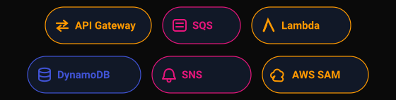
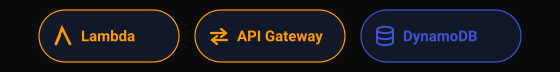

  <!-- Hero Section -->
  <picture>
    <source media="(prefers-color-scheme: dark)" srcset="assets/readme/hero.svg">
    <source media="(prefers-color-scheme: light)" srcset="assets/readme/hero.svg">
    
  </picture>

  <!-- Typing Animation -->
  

    

  
  

   

  <!-- About Section Header -->
  <picture>
    <source media="(prefers-color-scheme: dark)" srcset="assets/readme/section-header-about.svg">
    <source media="(prefers-color-scheme: light)" srcset="assets/readme/section-header-about.svg">
    
  </picture>

  

     
    

      I design and build <strong>cloud-native applications on AWS</strong> — systems that scale automatically, cost less to run, and stay reliable under real production load.
    

    

      My focus has shifted deliberately toward <strong>serverless architecture</strong>: event-driven systems built on <strong>Lambda, API Gateway, DynamoDB, SQS, and SNS</strong>, paired with modern frontends in <strong>Next.js</strong> and <strong>React</strong>, and shipped fast with <strong>AWS Amplify</strong>. The value I bring isn't just writing code — it's designing systems where infrastructure decisions and business decisions line up: pay for what you use, scale only what needs scaling, and keep the whole thing maintainable by a small team.
    

    

      I hold the <strong>AWS Certified Cloud Practitioner</strong> certification and bring that cloud-native lens to every layer of the stack, from database schema to deployment pipeline.
    

  

   

  <!-- What I Build Section Header -->
  <picture>
    <source media="(prefers-color-scheme: dark)" srcset="assets/readme/section-header-build.svg">
    <source media="(prefers-color-scheme: light)" srcset="assets/readme/section-header-build.svg">
    
  </picture>

  

     
    <table>
      <tr>
        <td width="40" align="center">⚡</td>
        <td><strong>Event-driven backends</strong> — Lambda functions orchestrated through API Gateway, SQS, and SNS</td>
      </tr>
      <tr>
        <td width="40" align="center">🗄️</td>
        <td><strong>Serverless data layers</strong> — single-table DynamoDB designs built for cost and access-pattern efficiency</td>
      </tr>
      <tr>
        <td width="40" align="center">🚀</td>
        <td><strong>Full-stack platforms</strong> — Next.js and React frontends deployed and hosted via AWS Amplify</td>
      </tr>
      <tr>
        <td width="40" align="center">🔔</td>
        <td><strong>Real-time & asynchronous systems</strong> — decoupled services using queues, topics, and WebSockets</td>
      </tr>
      <tr>
        <td width="40" align="center">☁️</td>
        <td><strong>Cost-aware architecture</strong> — infrastructure that scales to zero and scales up only on demand</td>
      </tr>
    </table>
  

   

  <!-- Core AWS & Serverless Stack Header -->
  <picture>
    <source media="(prefers-color-scheme: dark)" srcset="assets/readme/section-header-stack-aws.svg">
    <source media="(prefers-color-scheme: light)" srcset="assets/readme/section-header-stack-aws.svg">
    
  </picture>

   

  

   

  <!-- Full-Stack Toolkit Header -->
  <picture>
    <source media="(prefers-color-scheme: dark)" srcset="assets/readme/section-header-stack-full.svg">
    <source media="(prefers-color-scheme: light)" srcset="assets/readme/section-header-stack-full.svg">
    
  </picture>

   

  

    

  <!-- Featured Projects Header -->
  <picture>
    <source media="(prefers-color-scheme: dark)" srcset="assets/readme/section-header-projects.svg">
    <source media="(prefers-color-scheme: light)" srcset="assets/readme/section-header-projects.svg">
    
  </picture>

   

  <table width="100%">
    <tr>
      <td width="50%" valign="top">
        <h3>🏗️ SentryNode Fraud Engine</h3>
        

          Event-driven, serverless transaction monitoring and real-time fraud detection engine. Ingests and scores transactions through a fully decoupled AWS pipeline.
        

        

          
           
          
        

        

          
        

      </td>
      <td width="50%" valign="top">
        <h3>☕ Ubuntu Smart Cafe</h3>
        

          Serverless, full-stack Smart Cafe platform — ordering and operations built entirely on managed AWS infrastructure, with zero servers to maintain.
        

        

          
          
           
          
        

        

          
        

      </td>
    </tr>
  </table>

   

  <!-- GitHub Stats Section Header -->
  <picture>
    <source media="(prefers-color-scheme: dark)" srcset="assets/readme/section-header-stats.svg">
    <source media="(prefers-color-scheme: light)" srcset="assets/readme/section-header-stats.svg">
    
  </picture>

  <!-- GitHub Stats -->
  

    

  <!-- Contribution Graph -->
  

    

  <!-- Connect Section Header -->
  <picture>
    <source media="(prefers-color-scheme: dark)" srcset="assets/readme/section-header-connect.svg">
    <source media="(prefers-color-scheme: light)" srcset="assets/readme/section-header-connect.svg">
    
  </picture>

  

     
    

      I'm looking to join a team where I can own systems end-to-end — from architecture and database design through deployment — and where serverless isn't a buzzword but an operating principle. If you're building something in that space, I'd welcome the conversation.
    

  

   

  
  

    

  <!-- Footer -->
  <picture>
    <source media="(prefers-color-scheme: dark)" srcset="https://capsule-render.vercel.app/api?type=waving&color=0:14b8a6,50:0f766e,100:1e1b4b&height=100&section=footer&width=100%">
    <source media="(prefers-color-scheme: light)" srcset="https://capsule-render.vercel.app/api?type=waving&color=0:14b8a6,50:0f766e,100:1e1b4b&height=100&section=footer&width=100%">
    
  </picture>

